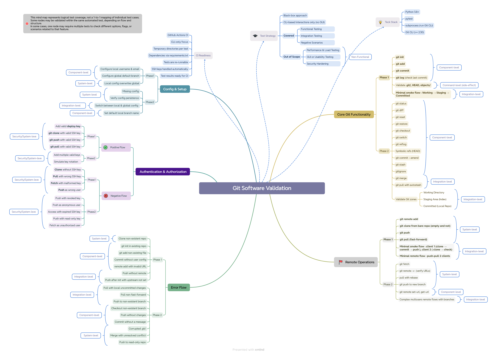

# Git Software Validation

## Table of Contents

- [About](#about)
- [Strategy](#strategy)
- [Mindmap](#mindmap)
- [Project Structure](#project-structure)
- [Fixtures & Architecture](#fixtures--architecture)
- [How to Run](#how-to-run)
- [What Is Covered (Phase 1)](#what-is-covered-phase-1)
- [Not Covered Yet](#not-covered-yet)
- [Continuous Integration](#continuous-integration)
- [Phase 2 (Planned)](#phase-2-planned)
- [Mindmap Coverage Table](#mindmap-coverage-table)
- [Summary](#summary)

---

## About

This repository contains a test suite focused on validating core and remote Git functionality.

The implementation covers essential Git workflows — including repository initialization, local committing, client-server synchronization, and configuration management — using Python and `pytest`.

All tests interact with the Git CLI through subprocess calls, without relying on third-party Git libraries or mocks. This approach ensures that behavior is validated directly against Git’s native command-line interface.

---

## Strategy

Before starting the implementation, the scope was structured by building a detailed mindmap. This helped to split Git behavior into logical, testable units and group them by importance and abstraction level. The mindmap also served as a foundation for defining the phases of implementation.

The chosen strategy combines tests of **different levels**, aiming to cover both isolated Git commands and real-world usage patterns:

- **Component-level tests** verify atomic Git operations (e.g., `add`, `commit`, `config`) in isolation.
- **Integration-level smoke tests** simulate client-server interactions and check how multiple commands work together in a flow.
- **System-level coverage** focuses on edge cases and misconfigurations (e.g., pushing without upstream, invalid remotes).

This multi-level approach supports scalable test suite growth step by step — starting from basic Git operations, and moving toward more advanced cases like multi-user workflows and SSH authentication in later phases.

In Phase 1, two **integration-level smoke tests** were implemented to validate realistic user actions from repository setup to remote synchronization. These end-to-end flows demonstrate that not only individual commands work correctly, but also the expected behavior of Git as used in practical scenarios.

---

## Mindmap

The mindmap provides a high-level breakdown of Git functionality into logical test areas.  
It was used to define the scope of Phase 1 and to plan future phases of coverage.

Note that the mindmap does **not represent a 1-to-1 mapping to tests**. Instead, it outlines functional coverage units — each of which may be validated by multiple test cases across different modules.  
Conversely, a single test may contribute to several units simultaneously.



---

## Project Structure

```
git-software-validation/
├── fixtures/           # Fixtures for local and remote repo setup (e.g., git_repo.py, git_remote.py)
├── hooks/              # Pytest log reporting (e.g., logging_hooks.py)
├── tests/              # Grouped by feature: core, remote, config, error
├── utils/              # Command runners and validation helpers (e.g., helpers.py, validators.py)
├── logging_config.py   # Logger setup
├── conftest.py         # Shared hooks and fixture imports
```

---

## Fixtures, Logging & Architecture

### Fixtures

Fixtures are organized by type and provide isolated, reusable building blocks for test setup:

- `git_repo.py`: handles local repository initialization, staging, committing, and user config.
- `git_remote.py`: sets up a bare repository and simulates remote push/pull/clone between local clients.
- `client_paths.py`: resolves the Git binary path, defaulting to `/usr/bin/git` (can be overridden via environment variable).

Each test is executed in isolation using `tempfile.TemporaryDirectory()`, ensuring no shared state.  
Client-server interactions are simulated locally using bare repositories — no real network configuration is involved.

Fixtures follow a modular structure that supports extension in future phases. Examples include repository builders and templated repo states, which would improve reuse and reduce duplication in complex flows.

### Fixture Validation

All core fixtures are covered by test cases to ensure reliability of the commands they encapsulate.  
Key operations such as `commit`, `clone`, and `config` are verified in `test_core_phase1.py`, `test_remote_operations_phase1.py`, and other Phase 1 test modules.

This approach ensures that each fixture behaves as expected before being reused in more complex test flows.

### Logging

A structured logging system is integrated to separate concerns and provide clarity when analyzing test behavior.

**Active loggers in Phase 1:**
- `git_test` – logs high-level test execution: start, pass/fail, and context messages.
- `infra` – captures detailed output from fixture logic and environment setup.

**Preconfigured for future phases:**
- `auth` – for SSH and authentication-related events.
- `client_sim` – to trace multi-client interactions.
- `ci` – for CI pipeline-specific reporting.

This layered structure improves debuggability in both local and CI environments. Logs remain focused, relevant, and easy to filter, making it easier to trace root causes during test failure analysis.

---

## How to Run

1. Set up a virtual environment (requires Python 3.9+ and Git CLI):
```bash
python3 -m venv venv
source venv/bin/activate
pip install -r requirements.txt
```

2. Run tests:
```bash
pytest -v
```

All tests use isolated environments. No system-wide Git configuration is touched.

---

## What Is Covered (Phase 1)

### Core Git
- `git init`
- `git add`
- `git commit`
- `git log`
- Integration smoke test for minimal local flow (`test_git_minimal_local_flow`)

### Remote Operations
- Add remote
- Clone from local path
- Push and pull to/from bare server
- Integration smoke test for multi-client workflow

### Config and Setup
- Set local `user.name` and `user.email`
- Set default branch
- Override global config

### Error Flows
- Commit without user config
- Clone non-existent repo
- Add non-existent file
- Add invalid remote
- Push without remote
- Push without upstream set

---

## Not Covered Yet

### SSH Authentication

Authentication and SSH-based Git flows are not yet implemented in Phase 1.

This was intentionally postponed due to the additional complexity of managing SSH daemons and key-based access inside test environments, especially in CI.

The current architecture is prepared for this extension:
- SSH daemon can be integrated into the remote fixture
- Temporary SSH keys can be generated dynamically
- `GIT_SSH_COMMAND` allows full control over authentication logic

Test scenarios are already outlined in the [mindmap](#mindmap), and include both **positive** and **negative** authentication paths:

Details of the planned test cases are documented in [`NOT_IMPLEMENTED.md`](./NOT_IMPLEMENTED.md).

---

## Continuous Integration

This project is fully compatible with CI environments and was designed to support clean, reproducible test runs.

### CI Requirements
- Python 3.9 or later  
- Git CLI installed and accessible in `$PATH`  
- No global Git configuration dependencies  
- Ability to run shell commands via subprocess  

### Typical CI Workflow
1. Check out the repository  
2. Set up Python environment  
3. Install required dependencies via `requirements.txt`  
4. Run all tests using `pytest`  
5. Upload an HTML report as a build artifact  

A real, working GitHub Actions pipeline is provided in [`pytest.yml`](.github/workflows/pytest.yml).  
It is triggered automatically on every push or pull request to the `main` branch, runs the full test suite, and generates an HTML report that can be downloaded from the **Actions** tab in the GitHub UI.

---

## Phase 2 (Planned)

The second phase will extend test coverage to advanced Git operations and authentication flows.

### Planned areas:
- Core Git extensions (`status`, `diff`, `reset`, `switch`, etc.)
- Branching and collaboration (`merge`, `rebase`, `stash`, conflict resolution)
- Remote edge cases (`force push`, read-only remotes, orphaned branches)
- SSH authentication and key-based access control

More detail is available in [`NOT_IMPLEMENTED.md`](./NOT_IMPLEMENTED.md).

---

## Mindmap Coverage Table

| Mindmap Block                  | Covered In Tests                                  | File(s)                                                                 |
|-------------------------------|---------------------------------------------------|-------------------------------------------------------------------------|
| **Core Git Functionality**    | `init`, `add`, `commit`, `log`                   | `tests/core/test_core_phase1.py`                                       |
| **Remote Operations**         | `clone`, `push`, `pull`, `integration smoke`     | `tests/remote/test_remote_operations_phase1.py`                        |
| **Config & Setup**            | local/global config, default branch              | `tests/config_and_setup/test_config_setup_phase1.py`                   |
| **Error Flows**               | commit w/o config, push w/o remote, invalid ops  | `tests/error_flows/test_error_flow_phase1.py`                          |
| **Authentication & SSH**      | Not implemented yet                              | See [`NOT_IMPLEMENTED.md`](./NOT_IMPLEMENTED.md)                       |
| **Phase 2 Blocks**            | scheduled for next iteration                     | See [Phase 2 section](#phase-2-planned)                                |
| **CI Readiness**              | subprocess-based, stateless                      | `conftest.py`, `fixtures/`, `.github/workflows/pytest.yml`             |

---

## Summary

This repository provides a structured and extensible test suite for validating core Git functionality, including local operations, remote synchronization, and configuration handling.

Phase 1 focused on foundational workflows — from repository setup to client-server interaction — and validated them across component, integration, and system levels. Fixtures were designed for reuse and CI compatibility, and their reliability was confirmed through targeted tests.

The project structure allows gradual expansion, with Phase 2 planned to cover branching, collaboration workflows, and SSH authentication scenarios.

Tests are mapped to functional units from the mindmap and built around real-world use cases rather than isolated commands.  
This ensures the suite remains maintainable, realistic, and ready to scale.
