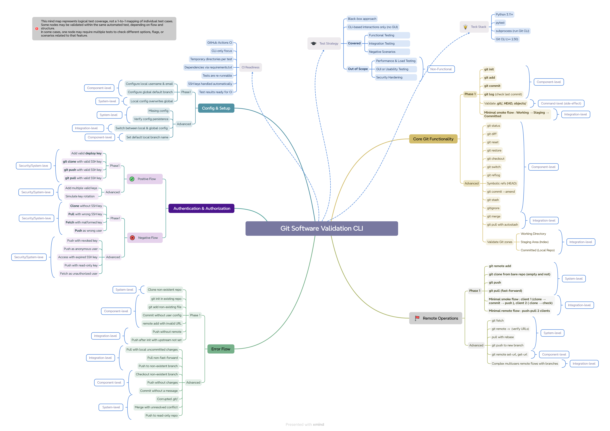
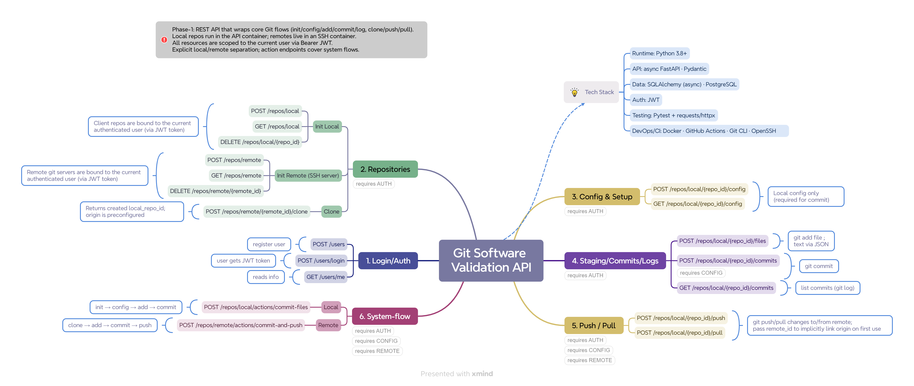
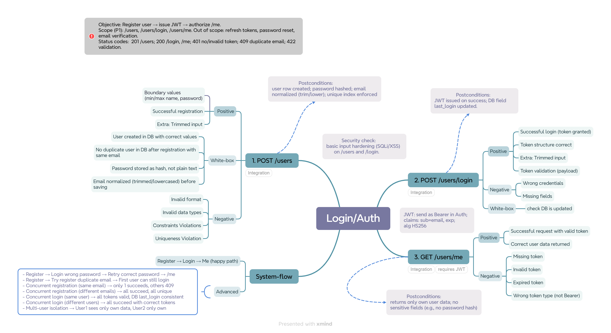

# Git Software Validation

## Table of Contents
- [Key Highlights](#key-highlights)
- [Current Status](#current-status)
- [Project Structure](#project-structure)
- [Environment Variables](#environment-variables)
- [Pytest Configuration](#pytest-configuration)
- [Phase 1 — CLI Validation](#phase-1--cli-validation)
  - [About](#about)
  - [Strategy](#strategy)
  - [Mindmap (CLI Scope)](#mindmap-cli-scope)
  - [Fixtures, Logging & Architecture](#fixtures-logging--architecture)
  - [What Is Covered (Phase 1)](#what-is-covered-phase-1)
  - [Out of Scope](#out-of-scope)
  - [How to Run (CLI)](#how-to-run)
- [Phase 2 — API Validation](#phase-2--api-validation)
  - [About Phase 2](#about-phase-2)
  - [Implemented: Authentication Flow](#implemented-authentication-flow)
  - [Backend Design (Auth)](#backend-design-auth)
  - [Test Strategy](#test-strategy)
  - [What Is Covered](#what-is-covered)
  - [Out of Scope](#out-of-scope-1)
  - [Logs & CI Readiness](#logs--ci-readiness)
  - [Next Steps](#next-steps)
  - [How to Run (API)](#how-to-run-1)
- [Summary of Commands](#summary-of-commands)

An **end-to-end test automation framework** built from scratch to validate Git functionality across multiple layers.  
It combines CLI-level Git validation, API testing against a custom FastAPI + PostgreSQL backend (tested via requests), and automated CI pipelines with Docker and GitHub Actions.  
The project demonstrates validation engineering at scale: from test strategy and framework design to backend implementation and full CI integration.  

## Key Highlights  
- **Pytest-based test framework**: modular fixtures, parametrization, hooks, validators, structured logging, and layered coverage (positive, negative, integration, error flows).  
- **Backend API (Phase 2)**: implemented from scratch with FastAPI (async) and Postgres — includes secure JWT authentication, async DB sessions, modular routes/CRUD, custom exceptions, and autogenerated OpenAPI/Swagger UI docs.  
- **Validation across multiple layers**:  
  - Phase 1 (CLI) — validation of core Git workflows through safe subprocess execution, covering repository setup, commits, configuration overrides, remote synchronization, and structured error flows.  
  - Phase 2 (API/Auth) — validation of authentication flows (user registration, login, token-based profile access, health checks) using HTTP requests with the `requests` library, including positive, negative, integration, and smoke scenarios.  
  - Phase 2 (API/Git ops, planned) — validation of repository lifecycle and collaboration flows (init, clone, commit, push) through API wrappers around Git subprocess execution.
- **Continuous Integration (GitHub Actions)**: Dockerized workflows (API, DB, Tests) with enforced coverage (≥80%), reproducible builds, and artifact export (coverage reports, HTML reports, structured logs).  
- **Reproducible environments**: Docker Compose setups for local development and CI pipelines, ensuring identical execution everywhere.  

For detailed descriptions see: [Phase 1 — CLI Validation](#phase-1--cli-validation) | [Phase 2 — API Validation](#phase-2--api-validation)


## Current Status  
- **Phase 1 (CLI)** — completed: 20+ automated CLI tests (including parametrized error cases) covering repository setup, commits, configuration overrides, remote synchronization, and error flows.  
- **Phase 2a (API/Auth)** — completed: implemented a full authentication backend (FastAPI + Postgres) with 4 endpoints (`/users`, `/users/login`, `/users/me`, `/health`) and 15+ automated API tests (positive, negative, integration, smoke).  
- **Phase 2b (API/Git ops)** — planned next: API endpoints for repository lifecycle (`init`, `clone`, `commit`, `push`) with subprocess safety and error mapping.

---

## Project Structure  
```text
git-software-validation/
├── api/
│ ├── crud/
│ ├── models/
│ ├── routes/
│ ├── schemas/
│ ├── utils/
│ ├── db.py
│ └── main.py
├── fixtures/
│ ├── git_repo.py
│ ├── git_remote.py
│ ├── client_paths.py
│ └── api/
├── hooks/
├── tests/
│ ├── cli_tests/
│ └── api_tests/
├── utils/
├── logs/
├── .github/workflows/
├── docker-compose.ci.yml
├── docker-compose.yml
├── Dockerfile
├── Dockerfile.test
├── logging_config.py
├── conftest.py
├── requirements.txt
├── pyproject.toml
└── README.md
```

### Key Components  
- **api/** → FastAPI backend (Phase 2): database models, Pydantic schemas, CRUD operations, routes, auth utilities.  
- **fixtures/** → pytest fixtures for CLI (Phase 1: repo setup, remote ops) and API (Phase 2: auth flows).  
- **hooks/** → pytest hooks for logging, timing, and custom configuration.  
- **tests/** → automated test suites: CLI validation (Phase 1) and API validation (Phase 2).  
- **utils/** → shared helpers, validators, constants, and custom exceptions.  
- **logs/** → structured logs from tests (collected as CI artifacts).  
- **docker-compose.ci.yml** → CI setup with three containers (API, DB, Tests).  
- **.github/workflows/** → GitHub Actions pipelines (pytest, coverage, log/report artifacts).  

---

## Environment Variables

The project uses a `.env` file for configuration (see `.env.example`).  
Copy `.env.example` to `.env` and adjust values as needed.

| Name | Purpose | Example |
|------|----------|---------|
| `POSTGRES_USER` | PostgreSQL database username | `git_validation_user` |
| `POSTGRES_PASSWORD` | PostgreSQL database password | `git_validation_password` |
| `POSTGRES_DB` | PostgreSQL database name | `git_validation` |
| `DB_HOST` | Database host (Docker service name in `docker-compose`) | `db` |
| `DB_PORT` | Database port | `5432` |
| `API_PORT` | FastAPI service port inside Docker | `8000` |
| `PYTHONPATH` | Python path inside Docker container | `/app` |
| `SECRET_KEY` | Secret key for signing JWT tokens | `supersecretkey123` |
| `ACCESS_TOKEN_EXPIRE_MINUTES` | Lifetime of issued access tokens (minutes) | `30` |
| `ALGORITHM` | JWT signing algorithm | `HS256` |
| `API_BASE_URL` | Base URL for API tests | `http://localhost:8000` |

## Pytest Configuration

Pytest markers are registered in `pytest.ini`, so they can be used without warnings:

- `phase1` — CLI validation suite  
- `phase2` — API validation suite  
- `core`, `setup`, `integration`, `smoke`, `regression`, `auth`, `remote`, `error_flow`, `ci`, `infra`, `users`, `POC`  

Local runs are intentionally lightweight (no coverage/HTML overhead).  
CI runs (via `docker-compose.ci.yml`) enforce coverage ≥80% and generate reports.

Example (from CI configuration):

```yaml
command: >
  pytest
  --cov=utils
  --cov=fixtures
  --cov-report=term-missing
  --cov-report=html
  --cov-fail-under=80
  --html=reports/pytest_report.html
  --self-contained-html
  -v
```

## Phase 1 — CLI Validation  

### About  
Phase 1 contains a test suite focused on validating Git functionality directly through the **CLI**.  
Tests are written in Python with **pytest**, using safe subprocess calls (`shell=False`) to ensure that validation is performed against the real Git binary, not mocks or wrappers.  

The scope is intentionally limited to **core Git workflows** — repository initialization, committing, configuration, and synchronization with remotes.  
Advanced features such as rebasing or bisect are intentionally out of scope.  
This ensures focus on the most critical developer scenarios and provides a solid foundation before expanding into API-level validation (Phase 2).  

---

### Strategy  
Before starting the implementation, the scope was structured by building a dedicated CLI mindmap.  
This helped to split Git behavior into logical, testable units and group them by importance and abstraction level.  
The mindmap also served as a foundation for defining the phases of implementation.  

The chosen strategy combines tests of **different levels**, aiming to cover both isolated Git commands and real-world usage patterns:  

- **Component-level tests** verify atomic Git operations (e.g., `add`, `commit`, `config`) in isolation.  
- **Integration-level smoke tests** simulate client-server interactions and check how multiple commands work together in a flow.  
- **System-level coverage** focuses on edge cases and misconfigurations (e.g., pushing without upstream, invalid remotes).  

In Phase 1, two **integration-level smoke tests** were implemented to validate realistic user actions from repository setup to remote synchronization.  
These end-to-end flows demonstrate that not only individual commands work correctly, but also the expected behavior of Git as used in practical scenarios.  

---

### Mindmap (CLI Scope)  
The mindmap provides a high-level breakdown of Git functionality into logical test areas.  
It was used to define the scope of Phase 1 and to plan future phases of coverage.  

Note that the mindmap does **not represent a 1-to-1 mapping to tests**.  
Instead, it outlines functional coverage units — each of which may be validated by multiple test cases across different modules.  
Conversely, a single test may contribute to several units simultaneously.  

  

---

### Fixtures, Logging & Architecture  

#### Fixtures  
Fixtures are organized by type and provide isolated, reusable building blocks for test setup:  

- `git_repo.py`: handles local repository initialization, staging, committing, and user config.  
- `git_remote.py`: sets up a bare repository and simulates remote push/pull/clone between local clients.  
- `client_paths.py`: provides isolated temporary directories for simulating independent Git clients (via tmp_path_factory). Each test runs in its own client workspace to avoid collisions (e.g., multiple clones).

Each test is executed in isolation using pytest-fixtures `tmp_path / tmp_path_factory`, ensuring no shared state.  
Client-server interactions are simulated locally using bare repositories — no real network configuration is involved.  

Fixtures remain focused on CLI testing; API-specific fixtures are implemented separately in Phase 2.  

#### Fixture Validation  
All core fixtures are covered by test cases to ensure reliability of the commands they encapsulate.  
Key operations such as `commit`, `clone`, and `config` are verified in `test_core_phase1.py`, `test_remote_operations_phase1.py`, and other Phase 1 test modules.  

This approach ensures that each fixture behaves as expected before being reused in more complex test flows.  

#### Logging  
A structured logging system is integrated to separate concerns and provide clarity when analyzing test behavior.  
Active loggers in Phase 1:  
- `git_test` – logs high-level test execution: start, pass/fail, and context messages.  
- `infra` – captures detailed output from fixtures and subprocess execution.  
<br>
This layered structure improves debuggability in both local and CI environments. Logs remain focused, relevant, and easy to filter, making it easier to trace root causes during test failure analysis.
---

### What Is Covered (Phase 1)  
**Core Git**  
- `git init`, `git add`, `git commit`, `git log`  
- Integration smoke test for minimal local flow (`test_git_minimal_local_flow`)  

**Remote Operations**  
- Add remote, clone from local path, push and pull to/from bare server  
- Integration smoke test for multi-client workflow  

**Config and Setup**  
- Set local `user.name` and `user.email`, set default branch, override global config  

**Error Flows**  
- Commit without user config, clone non-existent repo, add non-existent file  
- Add invalid remote, push without remote, push without upstream set  

---

### Out of Scope  
To keep Phase 1 focused on the most critical Git functionality, the following areas are excluded:  
- Advanced Git commands outside of core workflows.  
- Performance, load, or GUI/usability testing.  
- SSH authentication and SSH server–based flows (postponed; planned separately).  
- Any API-related functionality (Phase 2 scope).  

---

### How to Run  

#### Local (non-Docker)  
Run CLI tests directly against your local Git binary:  
```bash
pytest -m "phase1"
```
---

## Phase 2 — API Validation  

### About Phase 2  
Phase 2 extends the project into the **API layer**, adding a service-oriented interface on top of Git operations. Modern systems rarely interact directly with Git binaries; instead, they expose functionality through APIs consumed by other services or end users. By validating Git through an HTTP interface backed by FastAPI and Postgres, this phase simulates a real-world scenario: user authentication, controlled access, and workflow execution through service endpoints.  

The roadmap for this phase is shown below:  

  

The diagram organizes work into six blocks: Authentication, Repository Management, Configuration, Commits, Push/Pull, and System Flows. Each block is designed to be tested independently while still contributing to complete workflows. This layered design mirrors how production services evolve — first securing identity, then building repository functionality, and finally validating cross-system flows.  

---

### Implemented: Authentication Flow  

The first milestone of Phase 2 is a fully working **Authentication Flow**, chosen as the foundation because without strong identity and token management, no further Git operation can be performed securely.  

  

The mindmap highlights both successful paths and error flows: user registration, login with JWT issuance, profile queries, and failure cases such as duplicate users, wrong credentials, or expired tokens.  

---

### Backend Design (Auth)  

The Authentication backend was **implemented from scratch** within this project.  
It integrates persistence, security, validation, and error handling into a self-contained FastAPI service that can be explored and tested locally or in CI.  

**Framework & API design**  
The service is built as an **asynchronous FastAPI application** with async SQLAlchemy integration.  
FastAPI provides non-blocking request handling and automatically generates OpenAPI/Swagger UI documentation.  
When running locally, the API can be inspected in a browser at [http://localhost:8000/docs](http://localhost:8000/docs), making it possible to explore and test endpoints interactively.  

**Database layer**  
Postgres runs in its own Docker container, managed with Docker Compose.  
The application uses **async sessions with dependency injection** (`Depends(get_session)`), ensuring each request opens and closes a clean database session.  
Tables are created automatically at startup via `Base.metadata.create_all`, providing a ready-to-use schema without separate migrations (Alembic migrations are intentionally out of scope for now).
In local runs, the Postgres container uses a mounted **Docker volume** for persistence, while in CI it runs as an ephemeral container for isolation and repeatability.  

**User model and schemas**  
A custom `User` entity defines id, email, hashed password, and `last_login`.  
Validation and serialization are handled by Pydantic schemas (`UserCreate`, `UserLogin`, `UserResponse`, `TokenResponse`), which enforce strict typing and consistent API contracts.  

**Security and JWT**  
Authentication is based on JWT (JSON Web Tokens), chosen as a lightweight, stateless, and widely adopted standard.  
- Passwords are hashed with bcrypt (Passlib).  
- On login, a JWT is generated with `sub` (the user’s email) and `exp` (expiry), signed with `SECRET_KEY` and `ALGORITHM`.  
- The token must be provided as a Bearer token to access protected endpoints such as `/users/me`.  
- This design eliminates the need for server-side sessions while maintaining secure, verifiable authentication. 
- Refresh tokens and advanced flows are excluded from this implementation (see Out of Scope).

**Error handling**  
This project defines its own set of custom exceptions (subclasses of `AppError`) to ensure consistent error management.  

- **Service-level exceptions** (`EmailAlreadyExists`, `InvalidTokenError`, `DatabaseError`, `DatabaseUnavailable`) are raised inside the business logic.  
- The **HTTP layer** catches them and translates them into consistent HTTP responses.  

This layered approach keeps business rules independent of transport concerns and guarantees predictable API responses.  

Common error mappings:

| Exception            | HTTP status              | Example case                        |
|----------------------|--------------------------|--------------------------------------|
| `EmailAlreadyExists` | 409 Conflict             | Registering with duplicate email     |
| `InvalidTokenError`  | 401 Unauthorized         | Using expired or malformed JWT       |
| `DatabaseError`      | 500 Internal Server Error| Unexpected DB error during request   |
| `DatabaseUnavailable`| 503 Service Unavailable  | DB container not reachable           |

**Project structure**  
The backend is modular, with responsibilities split across dedicated modules:  
- `db.py` manages connections and async sessions,  
- `models/` defines ORM entities,  
- `schemas/` handles Pydantic validation,  
- `utils/` encapsulates password hashing and JWT logic,  
- `routes/` defines FastAPI endpoints, linking HTTP layer to business logic,  
- `crud/` implements database operations for users and authentication.  

**Configuration**  
Sensitive values (DB credentials, `SECRET_KEY`, algorithm, token lifetime) are stored in `.env`, with `.env.example` provided for reproducibility.  

---

### Test Strategy  

Testing the Authentication Flow followed the same philosophy as in Phase 1 — focusing not only on functionality but also on resilience, security, and system reliability.  

Positive tests confirm that users can register, log in, and fetch their profile successfully. Integration tests validate the full lifecycle (register → login → `/me`) and check database side-effects such as updating `last_login`. Smoke tests provide a minimal path to verify readiness quickly in CI.  

Negative tests were structured deliberately into two layers: **business-level errors** (duplicate registrations, wrong credentials, expired tokens) and **low-level validation** (malformed payloads, missing fields, wrong token format). This systematic approach ensures stability across both functional and technical dimensions. Security-focused checks verify that passwords are stored as bcrypt hashes (never plain text), JWTs are correctly signed and validated, and responses never expose sensitive information.  

---

### What Is Covered  

Coverage is organized around the endpoints that form the backbone of the Authentication Flow. They represent the minimal but complete functionality needed to secure Git operations:  

- **`POST /users`** — registers a new user, enforces unique email, hashes the password, rejects invalid input.  
- **`POST /users/login`** — authenticates valid users, issues JWT, rejects wrong credentials or malformed payloads.  
- **`GET /users/me`** — returns user details for a valid token, rejects missing or invalid tokens.  
- **`GET /health`** — confirms DB availability, returns `503` if unavailable.  

Both smoke and integration flows are implemented, covering the full sequence from registration to authenticated access.  

---

### Out of Scope  

To keep the phase focused, features such as refresh tokens, password resets, email verification, and account deletion were intentionally excluded. They are not required for core Git workflows and can be deferred without limiting validation of essentials.  

---

### Logs & CI Readiness  

Logging is intentionally split for clarity in API testing:  
- **`api_test` logger** captures the main events of each test, keeping execution flow and outcomes easy to trace.  
- **`infra` logger** records supporting details such as validation steps, request/response contents, and environment events.  

This separation ensures that high-level results remain clear while detailed diagnostics are available when deeper investigation is needed. Both streams are saved under `logs/` and exported as CI artifacts together with coverage and HTML reports.  

---

### Next Steps  

According to the roadmap, the next milestones are repository management endpoints, repository configuration, commit and log operations, and push/pull flows. Each block will expand coverage and introduce new error scenarios, gradually extending validation from isolated Auth tests into complete multi-user Git workflows. Additional focus will be placed on observability (structured logs, detailed reports) and CI hardening to maintain stability as the system grows.  

---

### How to Run  

#### Running in CI
Continuous Integration uses `docker-compose.ci.yml`, which defines three containers: API, database, and tests. A single command builds everything, executes tests, and collects reports and logs:  

```bash
docker compose -f docker-compose.ci.yml up --build --exit-code-from tests
```

Reports and artifacts include coverage (`htmlcov/`), a Pytest HTML report (`reports/pytest_report.html`), and both infra and API test logs (`logs/`).  

#### Running locally  

For development, use `docker-compose.yml`, which defines only the API and database containers. Tests are executed from the host machine against the running API.  

1. Copy `.env.example` to `.env` and adjust values for your environment.  
   *On Windows, Docker Desktop with WSL2 backend is required.*  
2. Start API and DB containers:  
   ```bash
   docker compose -f docker-compose.yml up -d
   ```  
   Once containers are up, API docs are available at [http://localhost:8000/docs](http://localhost:8000/docs).

3. Run tests locally from your environment:  
   ```bash
   pytest tests/api_tests -m "phase2" -v
   ```  
4. Shutdown services when finished:  
   ```bash
   docker compose -f docker-compose.yml down -v
   ```  

## Summary of Commands

| Suite | Command |
| --- | --- |
| Phase 1 (CLI) | `pytest -m "phase1" -v` |
| Phase 2 (API, local via Docker Compose) | `docker compose -f docker-compose.yml up -d && pytest tests/api_tests -m "phase2" -v` |
| CI (compose) | `docker compose -f docker-compose.ci.yml up --build --exit-code-from tests` |

